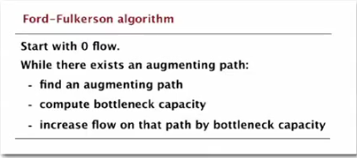

## Sorting Algorithm

1. Selection Sort
2. Insertion Sort-Shell Sort
3. Merge Sort
4. Quick Sort
5. Heap Sort(Priority Queue)

> Sorting Algorithms Performance


## Search Algorithm

### Binary Search Tree
Hibbard Deletion

### 2-3Tree Banlance Tree
1. 插入
- 1+1=2node -> 3node
- **1+2=3node -> 4node** -> 2node
- 将4node结点中间元素移至父结点，其余2元素分离为子2node节点

### Red-Black BST
- 基于2-3Tree，将3node用红色标记
- 关键：将红色标记向上传递至根部

### K-Dimensional Tree
- 分隔空间数据
e.g 左子树：左下方   右子树：右上方

### Fisrt Search
- DFS(深度优先)：栈实现
- BFS(广度优先)：队列实现


### cycle detection
- 许多图论算法不适用于存在环路的复杂图,故使用循环检测剔除意外情况
**处理方法：可将环路元素(如强联通分支)视作单一元素，忽视其内部结构**
```java
a = b+1;b = c+1;c = a+1;
//a extends b;b extends c;c extends a; 
```


## Map Algorithm

### MaxFLow Problem

1. MaxFlow-Mincut Theorem 最大流最小割定理
2. Radix-Sorts 基数排序(可用于混乱shuffle数组)
- 从个位到高位放入桶
- 从高位到个位放入桶
