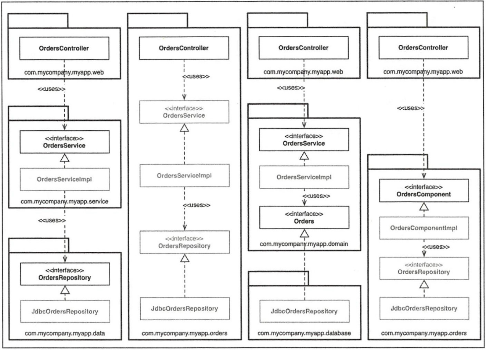

# Clean Architecture Basic Notes

## Domain Driven Design

### Interface Layer

主要负责与外部系统进行交互与通信:

- 做参数的基本处理, 比如入参校验, 回参 DTO 转换 (拆包, 组包)
- Dubbo Services
- RESTful API

### Application Layer

Application Service 层只是很薄的一层,
它内部并不实现任何逻辑,
只是负责协调和转发 (流程编排),
委派业务动作给更下层的领域层.

### Domain Layer

Domain 层是领域模型系统的核心,
负责维护面向对象的领域模型,
几乎全部的业务逻辑都会在这一层实现.
内部主要包含 Entity, ValueObject, Domain Event, Repository.

- `Controller` will receive the user’s requests and reply with a structured response.
- `Service` will process the user’s request,
  including validations and third-party reporting,
  and will receive data using the repository layer as a source of truth.
- `Repository` will function as the application’s source of truth,
  will include the DB and external services queries.

### Infrastructure Layer

主要为 Interface, Application 和 Domain 三层提供支撑:

- 封装基础资源服务, 通过依赖注入方式解耦.
- Third-party tools, Message Queue, File, Cache, Database, Search etc.
- 实现仓储接口 DB, 通常真正读写 DB.

### Domain Driven Design Reference

- Front-end domain driven design [guide](https://dev.to/bespoyasov/clean-architecture-on-frontend-4311).
- Scalable React project structure [guide](https://github.com/developerway/example-react-project).
- Nest.js clean architecture [template](https://medium.com/@jonathan.pretre91/clean-architecture-with-nestjs-e089cef65045).
- Domain driven design layout in [Golang](https://github.com/lupguo/ddd-layout).

## Scalability Design

- Prefer composites over mixins.
- Always clone objects between components.
- Use namespaced state store modules.
- Write robust tests.
- Interact with REST API via services/SDK.
- Wrap third-party libraries other using them directly:
  - Abstract: changing dependencies without changing interface.
  - Extendability: More obvious route to extending functionality.
- Stability:
  组件结构依赖图中各组件的稳定性指标 I 必须要按其依赖关系方向递减,
  让每个组件的 I 指标都必须大于其所依赖组件的 I 指标,
  `I = FanOut / (FanOut + FanIn)`,
  `I = 0` 表示不依赖任何模块 (最稳定),
  `I = 1` 表示不被任何模块依赖 (最不稳定).

## 高并发系统设计

### Concurrent Code Layer

- Mutex Performance
- Database Caches
- Update Merge
- BloomFilter
- Asynchronous
- Multi-Thread

### Concurrent DataBase Layer

- DataBase Type: RDBMS -> NoSQL -> NewSQL
- Table Structure Design
- Index Design
- Split Table
- Read and Write Separation
- Data Slice and Data Partition
- Hot Data Cache

### Concurrent Architecture Layer

- Microservices
- Scale Friendly
- FailFast
- Data PreFetch
- Multi-Level Caches

## 高可用系统设计

### Resource Isolation

### Load Balance Design

- Hardware Load Balance
- Software Load Balance
- Load Balance Algorithms:
  Random, RoundRobin, WeightRoundRobin, ConsistentHash
- Error Machines Auto Detection
- Error Services Auto Retirement
- Services Retry Automation
- Recovery Services Auto Detection

### Idempotence Design

在编程中一个幂等操作的特点是其任意多次执行所产生的影响均与一次执行的影响相同.

#### Write Idempotence Design

- Mutex
- Key Index
- Token
- Data Version
- State Machine

### CAP Theory

A distributed system to simultaneously provide
more than two out of the following three guarantees:

- Consistency:
  Every read receives the most recent write or an error.
- Availability:
  Every request receives a (non-error) response,
  without the guarantee that it contains the most recent write.
- Partition tolerance:
  The system continues to operate
  despite an arbitrary number of messages
  being dropped (or delayed) by the network between nodes.

### 服务熔断

### 服务限流

#### 服务限流算法

一定程度上可以参考计算机网络拥塞控制算法:

- 计数器固定窗口限流:
  单位时间内达到阈值后开始限流, 单位时间后重新计数.
  窗口临界处流量过大, 导致服务不可用.
- 滑动窗口限流:
  在固定窗口限流基础上, 将窗口向右滑动.
- 漏斗限流:
  未满前可进入, 满则拒绝.
  可以平滑流量, 无法解决突发流量.
- 令牌桶限流:
  在漏斗限流基础上, 以恒定速率产生令牌.
  拥有令牌可进入, 无则拒绝.
  可以平滑流量, 可以容忍突发流量.

#### 服务限流策略

- 服务拒绝
- 延时处理
- 请求分级
- 监控预警
- 动态限流
- 动态扩容

#### 服务限流位置

- 接入层限流: 通过 Nginx/API Router 对 DNS/IP 限流.
- 应用限流: 每个服务拥有自己的集群限流服务.
- 基础服务限流: 对消息队列/数据库限流.

### 服务降级
