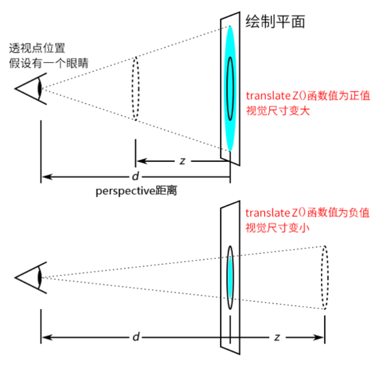
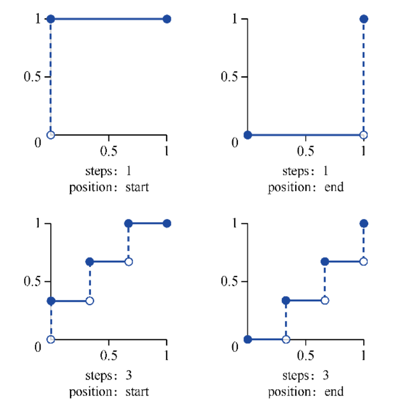

# CSS Animation Notes

## CSS Transform

`transform`:

- No affect on the CSS box model layout (excepts [`overflow`](#transform-alignment)).
- No affect on `display: inline` element.
- Affect the visual rendering.
- Affect client rectangles exposed by
  `Element Interface Extensions` (`getClientRects()`/`getBoundingClientRect()`).
- Affect after `clip`/`clip-path`: first `clip`/`clip-path`, then `transform`.
- Create new [stacking context](https://developer.mozilla.org/docs/Web/CSS/CSS_Positioning/Understanding_z_index/The_stacking_context).
- Create new [containing block](https://developer.mozilla.org/docs/Web/CSS/Containing_block#identifying_the_containing_block)
  for `absolute`/`fixed` positioned children.
- `<transform-function>+`: 多重变换**从右向左**按顺序执行.

### Translate Transform

`translate()`/`translateX()`/`translateY()`/`translateZ()`/`translate3d()`:

```css
.translate {
  /* 往右偏移10px, 往下偏移20px */
  transform: translate(10px, 20px);

  /* 往右偏移10px */
  transform: translateX(10px);

  /* 往下偏移20px */
  transform: translateY(20px);

  /* 往左偏移自身宽度的一半, 往上偏移自身高度的一半 */
  transform: translate(-50%, -50%);
}
```

### Scale Transform

`scale()`/`scaleX()`/`scaleY()`/`scaleZ()`/`scale3d()`:

```css
.scale {
  /* 水平放大 2 倍, 垂直缩小 1/2 */
  transform: scale(2, 0.5);

  /* 水平放大 2 倍 */
  transform: scaleX(2);

  /* 垂直缩小 1/2 */
  transform: scaleY(0.5);

  /* 水平翻转效果 */
  transform: scaleX(-1);

  /* 垂直翻转效果 */
  transform: scaleY(-1);
}
```

### Rotate Transform

`rotate()`/`rotateX()`/`rotateY()`/`rotateZ()`/`rotate3d()`:

- `deg`: degrees 角度 ($0$ ~ $360^{\circ}$).
- `grad`: grads 百分度 ($0$ ~ $400$).
- `rad`: radians 弧度 ($1^{\circ} = \frac{180}{\pi}$).
- `turn`: turns 圈数.

```css
.rotate {
  /* 正值顺时针, 负值逆时针 */
  transform: rotate(45deg);
  transform: rotate(50grad);
  transform: rotate(0.7854rad);
  transform: rotate(0.25turn);
}
```

### Skew Transform

`skew()`/`skewX()`/`skewY()`:

```css
.skew {
  /* 水平切斜 10 度, 垂直切斜 20 度 */
  transform: skew(10deg, 20deg);

  /* 水平切斜10度 */
  transform: skewX(10deg);

  /* 垂直切斜20度 */
  transform: skewY(20deg);
}
```

[](https://developer.mozilla.org/docs/Web/CSS/transform-function/skew)

### Matrix Transform

`matrix(a, b, c, d, e, f)`:

$$
\begin{bmatrix}
  a & c & e \\
  b & d & f \\
  0 & 0 & 1
\end{bmatrix}
\begin{bmatrix}
  x \\
  y \\
  1
\end{bmatrix}
\implies
\begin{bmatrix}
  ax + cy + e \\
  bx+ dy + f \\
  1
\end{bmatrix}
$$

$$
\begin{align}
   x' &= ax + cy + e  \\
   y' &= bx + dy + f
\end{align}
$$

Translate:

$$
\begin{align}
   x' &= 1 \cdot x + 0 \cdot y + e &= x + e \\
   y' &= 0 \cdot x + 1 \cdot y + f &= y + f
\end{align}
$$

Scale:

$$
\begin{align}
   x' &= a \cdot x + 0 \cdot y + 0  &= ax \\
   y' &= 0 \cdot x + d \cdot y + 0  &= dy
\end{align}
$$

Rotate:

$$
\begin{align}
   x' &= \cos\theta \cdot x - \sin\theta \cdot y \\
   y' &= \sin\theta \cdot x + \cos\theta \cdot y
\end{align}
$$

Skew:

$$
\begin{align}
   x' &= x + \tan{\theta x} \cdot y  \\
   y' &= \tan{\theta y} \cdot x + y
\end{align}
$$

```css
.matrix {
  transform: matrix(1, 0, 0, 1, var(--translate-x), var(--translate-y));
  transform: matrix(var(--scale-x), 0, 0, var(--scale-y), 0, 0);
  transform: matrix(var(--cos), var(--sin), var(--sin-minus), var(--cos), 0, 0);
  transform: matrix(1, var(--tan-y), var(--tan-x), 1, 0, 0);
}
```

### Transform Origin

[`transform-origin`](https://developer.mozilla.org/docs/Web/CSS/transform-origin)
change `transform` start point:

- X offset: `<length>`/`<percentage>`/`left`/`center`/`right`.
- Y offset: `<length>`/`<percentage>`/`top`/`center`/`bottom`.
- Z offset: `<length>`.

```css
.transform-origin {
  /* One-value syntax, the other is `50%`/`center` */
  transform-origin: 2px;
  transform-origin: bottom;

  /* x-offset | y-offset */
  transform-origin: 3cm 2px;
  transform-origin: left 2px;

  /* x-offset | y-offset | z-offset */
  transform-origin: 2px 30% 10px;
  transform-origin: left 5px -3px;
}
```

### Individual Transform

Individual transform [property](https://drafts.csswg.org/css-transforms-2/#individual-transforms):

- [`translate`](https://developer.mozilla.org/docs/Web/CSS/translate).
- [`scale`](https://developer.mozilla.org/docs/Web/CSS/scale).
- [`rotate`](https://developer.mozilla.org/docs/Web/CSS/rotate).

```css
.element {
  translate: 50%;
  translate: 100px 200px;
  translate: 50% 105px;
  translate: 50% 105px 5rem;
  scale: 2;
  scale: 2 0.5;
  scale: 2 0.5 2;
  rotate: 90deg;
  rotate: y 0.25turn;
  rotate: z 1.57rad;
  rotate: 1 1 1 90deg;
}
```

### Transform Style

`transform-style`:

- `flat`: initial value, 表示平面变换.
- `preserve-3d`: 表示 3D 透视变换.

### Transform Perspective

`perspective` 为 **3D** 转换元素定义透视视图:

```css
.parent {
  perspective: 201px;
}
```

- 设置的 `translateZ` 值越小, 则子元素大小越小 (因为元素远去, 我们眼睛看到的就会变小).
- `translateZ` 值越大, 该元素也会越来越大.
- 当 `translateZ` 值非常接近 201 像素, 但是不超过 201 像素的时候 (如 200 像素).
  该元素的大小就会撑满整个屏幕 (父辈元素没有 `overflow: hidden` 的限制).
- 当 `translateZ` 值再变大, 超过 201 像素的时候, 该元素看不见了.

[](https://developer.mozilla.org/docs/Web/CSS/perspective)

### Backface Visibility

```css
.element {
  backface-visibility: hidden;
}
```

当元素 `rotateY(180deg)` 时, 元素将被隐藏.

### Transform Container

- `:hover` should not add to transformed elements,
  `:hover` should add to parent element.
- 3D 变换一般需要在容器元素上加上以下样式:

```css
.transform-container {
  perspective: 1024px;
  transform-style: preserve-3d;
}

.front .back {
  backface-visibility: hidden;
}
```

### Transform Alignment

- Keep `translate(-50%, -50%)` in keyframe transform property list
  when using it for alignment.
- 父元素设置了 `transform` 变换,
  `position: fixed` 子元素固定定位失效.
- 父元素设置了 `transform` 变换 + `overflow: hidden`,
  `position: absolute` 子元素会被剪裁.
- 当变换绝对定位居中的元素时, 需要改变 `transform-origin`:

```css
.rotate {
  position: absolute;
  top: 200px;
  left: 50%;
  transform: translateX(-50%);
  transform-origin: left;
}
```

### Transform Reference

- Transform 101 [guide](https://learn.shayhowe.com/advanced-html-css/css-transforms).

## CSS Transition

### Transition Property

- `transition-property`: `all` (initial value).
- `transition-duration`.
- `transition-delay`: 支持负值.
- `transition-timing-function`: `<easing-function>`.

```css
.element {
  transition: property duration timing-function delay;
  transition: all 0s ease 0s;
  transition: transform 0.5s ease-in-out 0.2s;
}

@media only screen and (prefers-reduced-motion: reduce) {
  .element {
    transition: none;
  }
}
```

### Transition Timing Function

[`<easing-function>`](https://developer.mozilla.org/docs/Web/CSS/easing-function):

- `liner`.
- `<cubic-bezier-timing-function>`:
  - `ease`: `cubic-bezier(0.25, 0.1, 0.25, 1.0)`.
  - `ease-in`: `cubic-bezier(0.42, 0, 1.0, 1.0)`.
  - `ease-out`: `cubic-bezier(0, 0, 0.58, 1.0)`.
  - `ease-in-out`: `cubic-bezier(0.42, 0, 0.58, 1.0)`.
  - `cubic-bezier(<number [0,1]>, <number>, <number [0,1]>, <number>)`.
- `<step-timing-function>`:
  - `step-start`.
  - `step-end`.
  - `steps(<integer>[, jump-start | jump-end | jump-none | jump-both | start | end]?)`.
  - 可用
    animated `background-position` + `<step-timing-function>` + image sprites
    [模拟 GIFs](https://demo.cssworld.cn/new/5/4-6.php).

```css
:root {
  --ease-in-quad: cubic-bezier(0.55, 0.085, 0.68, 0.53);
  --ease-in-cubic: cubic-bezier(0.55, 0.055, 0.675, 0.19);
  --ease-in-quart: cubic-bezier(0.895, 0.03, 0.685, 0.22);
  --ease-in-quint: cubic-bezier(0.755, 0.05, 0.855, 0.06);
  --ease-in-expo: cubic-bezier(0.95, 0.05, 0.795, 0.035);
  --ease-in-circ: cubic-bezier(0.6, 0.04, 0.98, 0.335);
  --ease-out-quad: cubic-bezier(0.25, 0.46, 0.45, 0.94);
  --ease-out-cubic: cubic-bezier(0.215, 0.61, 0.355, 1);
  --ease-out-quart: cubic-bezier(0.165, 0.84, 0.44, 1);
  --ease-out-quint: cubic-bezier(0.23, 1, 0.32, 1);
  --ease-out-expo: cubic-bezier(0.19, 1, 0.22, 1);
  --ease-out-circ: cubic-bezier(0.075, 0.82, 0.165, 1);
  --ease-in-out-quad: cubic-bezier(0.455, 0.03, 0.515, 0.955);
  --ease-in-out-cubic: cubic-bezier(0.645, 0.045, 0.355, 1);
  --ease-in-out-quart: cubic-bezier(0.77, 0, 0.175, 1);
  --ease-in-out-quint: cubic-bezier(0.86, 0, 0.07, 1);
  --ease-in-out-expo: cubic-bezier(l, 0, 0, 1);
  --ease-in-out-circ: cubic-bezier(0.785, 0.135, 0.15, 0.86);
}
```

[](https://css-tricks.com/clever-uses-step-easing)

### Transition Direction

By specifying the transition on the element itself,
define the transition to occur in both directions
(hover on and hover off).

Change `transition` when `:hover` etc state bring magic effect:

```css
.menu-nav {
  visibility: hidden;
  transition: all 0.4s ease-in-out;
  transform: translateX(-100%);
}

.menu-link {
  opacity: 0;
  transition: opacity 0.4s ease-in-out;
}

.menu-toggle:checked ~ .menu-nav {
  visibility: visible;
  transform: translateX(0);
}

.menu-toggle:checked ~ .menu-nav .menu-link {
  opacity: 1;

  /* magic effect for delaying transition */
  transition: opacity 0.4s ease-in-out 0.4s;
}
```

### Transition Class Controls

With `transition: opacity 0.5s` set,
first add `.opacity-0` class,
then replace it with `.opacity-1` class.
Transition animation get trigger
as css style of element changed (class changed):

```css
@media only screen and (prefers-reduced-motion: reduce) {
  .element {
    transition: none;
  }
}

.element {
  transition: opacity 0.5s;
}

/* before-enter -> enter -> before-leave -> leave */
.enter,
.before-leave {
  opacity: 1;
}

.leave,
.before-enter {
  opacity: 0;
}
```

```ts
div.classList.add('before-enter');

setTimeout(() => {
  div.classList.remove('before-enter');
  div.classList.add('enter');
}, 20);
```

### Transition Internals

`transition` take effect only when
browser detecting different styles between `style` stage.

```ts
// transition not working
panel.style.transform = 'scale(0)';
panel.style.transition = 'transform .5s';
// previous `transform` is empty
panel.style.transform = 'scale(1)';

// transition working
panel.style.transform = 'scale(0)';
panel.style.transition = 'transform .5s';
// previous `transform` is `scale(0)`
requestAnimationFrame(() => {
  panel.style.transform = 'scale(1)';
});

// transition working
panel.style.transform = 'scale(0)';
// `getComputedStyle(element).property` trigger a new `style` stage
const computedTransform = getComputedStyle(panel).transform;
panel.style.transition = 'transform .5s';
// previous `transform` is `scale(0)`
panel.style.transform = 'scale(1)';
```

### Transition Reference

- Transition 101 [guide](https://zellwk.com/blog/css-transitions).

## CSS Animation

### Animation Property

[`animation` formal syntax](https://developer.mozilla.org/docs/Web/CSS/animation#formal_syntax):

- `animation-name`.
- `animation-duration`.
- `animation-delay`:
  支持负值.
- `animation-timing-function`:
  [`<easing-function>`](#transition-timing-function).
- `animation-iteration-count`:
  - `infinite | <number>` 执行次数.
  - 支持 `0` 与小数.
  - 不支持负值.
- `animation-direction`:
  - `normal`: `0%->100%` 方向.
  - `reverse`: `100%->0%` 方向.
  - `alternate`/`alternate-reverse`: 不断交替方向.
- `animation-fill-mode`:
  `forwards`/`backwards`/`both`.
- `animation-play-state`:
  `paused`/`running`.

```css
@media only screen and (prefers-reduced-motion: reduce) {
  .element {
    animation: none;
  }
}

.element {
  animation: name duration timing-function delay iteration-count direction;
}
```

### Animation Fill Mode

[`animation-fill-mode`](https://developer.mozilla.org/docs/Web/CSS/animation-fill-mode):

- `forwards`: 动画结束后, 应用动画最后一帧属性值.
- `backwards`: 动画开始前, 应用动画第一帧属性值.
- `both`: 同时应用上述两种效果.

| `animation-direction`         | `animation-iteration-count` | last keyframe |
| ----------------------------- | --------------------------- | ------------- |
| `normal`                      | even or odd                 | 100%          |
| `reverse`                     | even or odd                 | 0%            |
| `alternate`                   | even                        | 0%            |
| `alternate`                   | odd                         | 100%          |
| `alternate-reverse`           | even                        | 100%          |
| `alternate-reverse`           | odd                         | 0%            |
| `normal`/`alternate`          | 0                           | 0%            |
| `reverse`/`alternate-reverse` | 0                           | 100%          |

| animation-direction           | first keyframe |
| ----------------------------- | -------------- |
| `normal`/`alternate`          | 0%             |
| `reverse`/`alternate-reverse` | 100%           |

### Animation Play State

利用 `animation-paly-state`
与 JavaScript 添加 `.animate` 类控制动画开始和停止.

```css
div {
  animation-play-state: paused;
}

:checked ~ div {
  animation-play-state: running;
}
```

```css
@media only screen and (prefers-reduced-motion: reduce) {
  .to-animate {
    animation: none;
  }
}

.to-animate {
  animation: animationName 1.5s linear;
  animation-play-state: paused;
  animation-iteration-count: infinite;
}

.animate {
  animation-iteration-count: running;
}
```

```ts
element.classList.add('animate');
setTimeout(() => element.classList.remove('animate'), duration);
```

### Offset Animation

[`offset`](https://developer.mozilla.org/docs/Web/CSS/offset),
animating an element along a defined path:

- [`offset-position`](https://developer.mozilla.org/docs/Web/CSS/offset-position).
- [`offset-path`](https://developer.mozilla.org/docs/Web/CSS/offset-path).
- [`offset-distance`](https://developer.mozilla.org/docs/Web/CSS/offset-distance).
- [`offset-rotate`](https://developer.mozilla.org/docs/Web/CSS/offset-rotate).
- [`offset-anchor`](https://developer.mozilla.org/docs/Web/CSS/offset-anchor).

```css
.path {
  /* Offset position */
  offset: auto;
  offset: 10px 30px;
  offset: none;

  /* Offset path */
  /* stylelint-disable-next-line function-no-unknown */
  offset: ray(45deg closest-side);
  offset: url('arc.svg');
  offset: path('M 100 100 L 300 100 L 200 300 z');

  /* Offset path with distance and/or rotation */
  offset: url('circle.svg') 100px;
  offset: url('circle.svg') 40%;
  offset: url('circle.svg') 30deg;
  offset: url('circle.svg') 50px 20deg;

  /* Including offset anchor */
  /* stylelint-disable-next-line function-no-unknown */
  offset: ray(45deg closest-side) / 40px 20px;
  offset: url('arc.svg') 2cm / 0.5cm 3cm;
  offset: url('arc.svg') 30deg / 50px 100px;
}
```

### Animation FLIP Pattern

- First: 初始状态.
- Last: 动画结束状态.
- Invert: last 至 first 的 `transform` 属性.
- Play: `transition: transform .2s linear`.

```css
@media only screen and (prefers-reduced-motion: reduce) {
  .scale-up {
    transition: none;
  }
}

/* first: scale(1), last: scale(1.2) */
.scale-up {
  transition: transform 0.2s linear;
  transform: scale(0.8);
}

.scale-up:hover,
.scale-up:focus {
  transform: none;
}
```

### Animation Bounce Cache Pattern

- First `-100`.
- Then `+5`/`+20`.
- Finally `0`.
- 切换动画时, 需要先把之前的动画清除: 防止出现闪烁 Bug.

### Animation Helper

- `opacity`.
- `overflow: hidden`.
- `transform`: `scale`/`translate`.
- `transition`.
- `animation-delay`.
- `width`/`height`
- `max-width`/`max-height`.
- `margin`.
- `border-*`.
- `background`.
- `background-position`.
- `background` with multiple `gradient`.
- Single `box-shadow`
- Multiple `box-shadow`.
- `*-clip-*`.
- `mask-*`.
- `filter`.
- `backdrop-filter`.
- Pseudo element (`::before`/`::after`).
- Pseudo class (`:hover`/`:focus`/`:target`).
- Changing `top`/`right`/`bottom`/`left` of pseudo element
  can change animation start point:
  e.g `bottom: 0, right: 0` change `width`/`height` from `0` to `100%`,
  size animation will start from `bottom-right` corner.

```css
.animation-container {
  z-index: -1;
  overflow: hidden;
}
```

```css
/* 直接动画 */
.div {
  animation-name: name;
  animation-duration: 1s;
  animation-timing-function: cubic-bezier(0.42, 0, 0.58, 1);
  animation-delay: 0.5s;
}

/* hover 后再播放动画, 高级化 transform + transition */
.div:hover,
.div:focus {
  animation-name: name;
  animation-duration: 1s;
  animation-timing-function: cubic-bezier(0.42, 0, 0.58, 1);
  animation-delay: 0.5s;
}
```

### Animation API

DOM events:

- `animationiteration`: triggered after each animation iteration.
- `animationend`: triggered after an animation completes.
- `animationstart`: triggered at the start of an animation.

### GreenSock Library

#### TweenMax

```ts
TweenMax.fromTo(element, 1, { x: 0 }, { x: 100 });
```

#### TimelineMax

```ts
const tl = new TimelineMax();
tl.staggerFrom(
  [
    '#Cap_1 > g > path:nth-child(1)',
    '#Cap_1 > circle:nth-child(7)',
    '#Cap_1 > path:nth-child(6)',
    '#Cap_1 > circle:nth-child(5)',
  ],
  1,
  {
    scaleY: 0,
    scaleX: 0,
    transformOrigin: 'center',
    ease: Bounce.easeOut,
    stagger: 0.2,
  }
);
```

### Animation Reference

- Animatable CSS [properties](https://developer.mozilla.org/docs/Web/CSS/CSS_animated_properties).
- Animation 101 [guide](https://github.com/cssanimation/css-animation-101).
