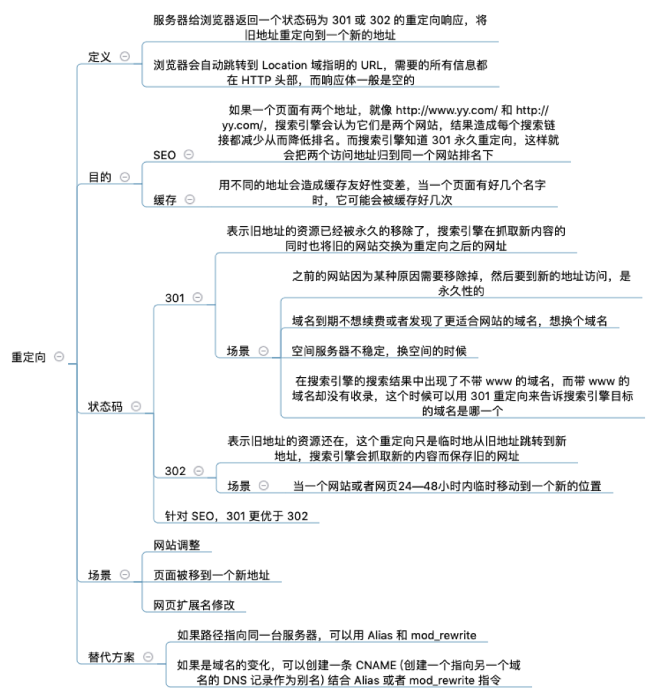
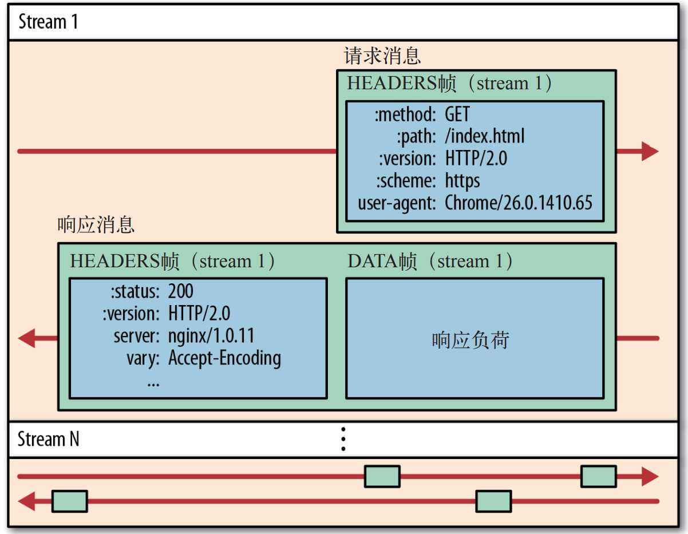
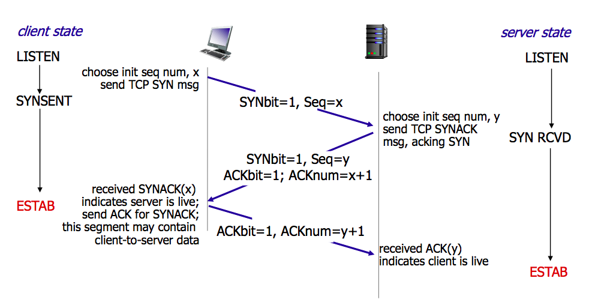
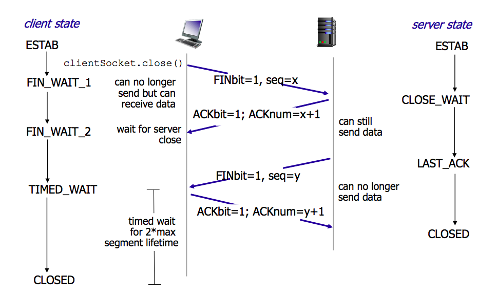
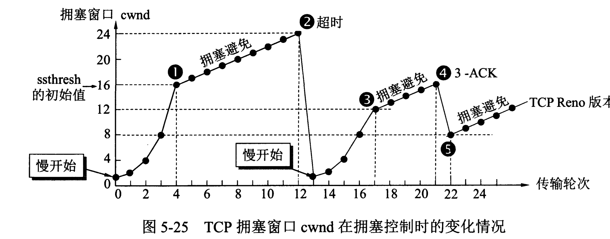
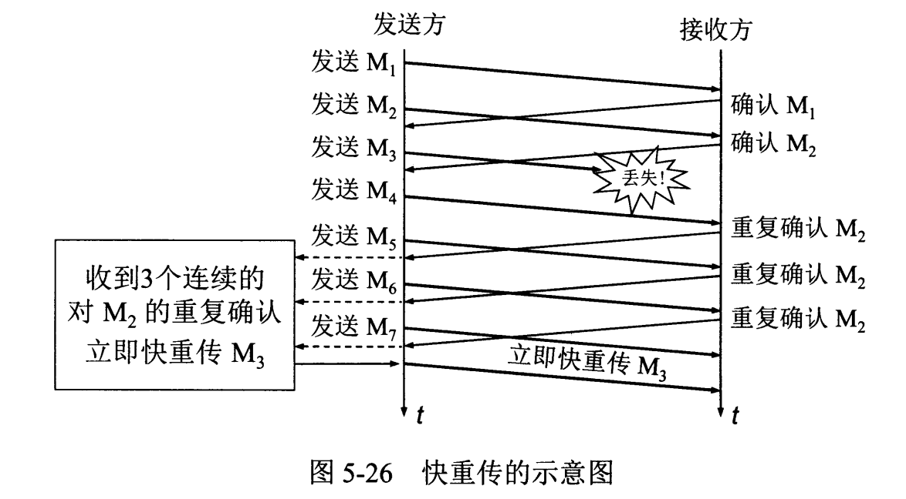

# Network Basic Notes

## Internet

End-to-end principle: implement features in the end-system/hosts where possible.

> Congestion implemented on Transport Layer.

### Consist

Internet Service Provider -> Packet Switch/Communication Link -> Host/End System.

### Delay

nodal = proc + queue + trans + prop: 总时延 = 产生/到达时延 + 排队时延 + 传输时延 + 传播时延.

### Layer

#### Internet Layer

- Application layer protocol: HTTP SMTP (message, stream of data).
- Transport layer protocol: TCP UDP (segment, segment of data).
- Network layer protocol: IP (因特网的粘合剂) (**unreliable** datagram, packet of data).
- Data link layer protocol: WiFi PPP(点对点) 以太网 (frame).
- Physical layer protocol.

#### Layering Principle

- Modularity.
- Well defined service: simple service model provided by lower level,
  providing for higher level.
- Reuse.
- Separation of concerns.
- Continuous improvement: change inner structure of layer independently.

## HTTP 1

Application layer protocol defines:

- Types of messages exchanged.
- Syntax of various message types(fields definition).
- Semantics of fields.
- Rules for when/how to send/respond to messages.

### Hypertext Transfer Protocol

Hypertext Transfer Protocol (RFC 2068):

- HTTP -> Socket Interface -> TCP.
- Stateless protocol.
- HTTP/1.0 默认不开启长连接: 客户端与服务端必须同时发送 `Connection: Keep-Alive`.
- HTTP/1.1 默认开启长连接:
  - `Keep-Alive: timeout=5, max=100`:
    表示 TCP 通道保持 5 秒, 最多接收 100 次请求.
  - `Keep-Alive` 无法保证客户端和服务器之间的连接一定活跃.
- HTTP 为无状态协议: 每个请求相互独立.

### HTTP Connections

- Non-persistent connections: 1 http request with 1 tcp connection.
- Persistent connections: multiple http request with 1 tcp connection.

### HTTP Message Format

HTTP request format:

```bash
request line -> (method field, object url field, protocol version)
header lines -> Host/Connections(close -> non-persistent connection)/User-agent/Accept-language
\r\n
entity body
```

HTTP response format:

```bash
status line -> (protocol version, status code, corresponding status message)
header lines -> Connections/Date/Server/Last-Modified/Content-Length(bytes)/Content-Type
\r\n
entity body
```

### HTTP Process

#### Port to Transport Layer

- Bandwidth-sensitive application: UDP.
- Reliable-sensitive application: TCP.

| Application            | Application Layer | Transport Layer |
| ---------------------- | ----------------- | --------------- |
| Email                  | SMTP              | TCP             |
| Remote terminal access | Telnet            | TCP             |
| Web                    | HTTP/HTTPS        | TCP             |
| File transfer          | FTP               | TCP             |
| Streaming multimedia   | HTTP/HTTPS/RTP    | TCP/UDP         |
| Internet telephony     | SIP/RTP           | UDP             |

#### HTTP Address

- IP (32 bits network layer): find specific host/end-system.
- Port (16 bits transport layer): find specific process.

### HTTP Response Status Codes

[RFC 2616](https://developer.mozilla.org/docs/Web/HTTP/Status):

- Informational responses: 100–199.
- Successful responses: 200–299.
  - 200 OK.
  - 201 Created.
  - 202 Accepted.
- Redirects: 300–399.
  - 301 Moved Permanently.
  - 302 Found.
  - 304 Not Modified.
  - 307 Temporary Redirect.
  - 308 Permanent Redirect.
- Client errors: 400–499.
  - 400 Bad Request.
  - 401 Unauthorized.
  - 403 Forbidden.
  - 404 Not Found.
  - 405 Method Not Allowed.
  - 406 Not Acceptable.
- Server errors: 500–599.
  - 500 Internal Server Error.
  - 501 Not Implemented.
  - 502 Bad Gateway.
  - 503 Service Unavailable.
  - 504 Gateway Timeout.



Use reasonable HTTP status codes:

- 200: general success.
- 201: successful creation.
- 301: moved permanently (SEO friendly).
- 302: moved temporarily.
- 304: not modified (HTTP cache).
- 400: bad requests from client.
- 401: unauthorized requests.
- 403: missing permissions.
- 404: missing resources.
- 429: too many requests.
- 5xx: internal errors (these should be avoided at all costs).

### HTTP 1.x Performance

限制 Web 性能的主要因素是客户端与服务器之间的网络往返延迟 (RTT):

- 持久化连接以支持连接重用: `N` 次 HTTP 请求节省的总延迟时间为 `(N-1) * RTT`.
- 分块传输编码以支持流式响应.
- 请求管道以支持并行请求处理 (局限性较大):
  - FIFO 管道, 队头请求会阻塞后续请求.
  - 应用必须处理中断的连接并恢复.
  - 应用必须处理中断请求的幂等问题.
  - 应用必须保护自身不受出问题的代理的影响.
- 模拟多路复用: 并行使用多个 TCP 连接 (大多数现代浏览器支持每个主机打开 6 个连接).
- 利用多个 TCP 连接进行域名分区.
- Resources bundling and inlining (但一定程度上放弃缓存粒度).
- 改进的更好的缓存机制.

## HTTP 2

### HTTP 2 Upside

在 HTTP/1.x 中, 每次请求都会建立一次 HTTP 连接:

- 串行的文件传输. 当请求 a 文件时, b 文件只能等待.
- 连接数过多.

HTTP/2 的多路复用就是为了解决上述的两个性能问题.
在 HTTP/2 中, 有两个非常重要的概念, 分别是帧 (frame) 和流 (stream).
帧代表着最小的数据单位, 每个帧会标识出该帧属于哪个流, 流也就是多个帧组成的数据流.
多路复用, 就是在一个 TCP 连接中可以存在多条流, 避免队头阻塞问题和连接数过多问题.




HTTP/2 = `HTTP` + `HPack / Stream` + `TLS 1.2+` + `TCP`:

- HTTP 2.0 的主要目标是改进传输性能, 实现低延迟和高吞吐量.
- 二进制传输 (乱序二进制帧 Stream):
  HTTP/1.1 不是二进制传输, 而是通过文本进行传输.
  由于没有流的概念, 在并行传输数据时,
  接收端无法区分多个响应分别对应的请求,
  无法将多个响应的结果重新进行组装,
  无法实现多路复用.
- Multiplexing (多路复用): more parallelized requests.
- Header compression (HPack): 降低协议字节开销占比 (尤其是 `Cookie` 带来的性能瓶颈).
- 双向流量控制 (`WINDOW_UPDATE` 帧更新).
- Server push:
  - 客户端可以缓存推送过来的资源.
  - 客户端可以拒绝推送过来的资源.
  - 推送资源可以由不同的页面共享.
  - 服务器可以按照优先级推送资源.
- HTTPS guaranteed: 事实加密 (Chrome/Firefox 只支持 HTTP/2 over TLS 1.2+).

### HTTP 2 Downside

HTTP/2 虽然通过多路复用解决了 HTTP 层的队头阻塞,
但仍然存在 TCP 层的队头阻塞 (`Head-of-line Blocking`):

- 由于 TCP 不支持乱序确认, 当没有收到队头 (滑动窗口最左端) 的 ACK 确认报文时,
  发送窗口无法往前移动, 此时发送方将无法继续发送后面的数据, 产生发送窗口的队头阻塞问题.
- 同样地, 当接收窗口接收有序数据时, 当没有收到队头 (滑动窗口最左端) 的数据时,
  接收窗口无法往前移动, 此时接收方将直接丢弃所有滑动窗口右侧的数据, 产生接收窗口的队头阻塞问题.

QUIC (基于 UDP 的可靠协议)
给每一个 Stream 都分配了一个独立的滑动窗口,
使得一个连接上的多个 Stream 之间没有依赖关系,
拥有相互独立各自控制的滑动窗口.

### HTTP 2 Optimization

HTTP 2 performance:

- Reducing HTTP requests:
  - 重用 TCP 连接.
  - 多路复用.
  - 减少传输冗余资源.
- Caching and reducing DNS lookups:
  - Remove too much domains.
  - HTML5 DNS prefetch.
- Avoid HTTP redirects.
- CDN: minimize RTT.
- Web caches.
- Resources minification.

Due to asset granularity and **caching effectiveness**:

- No need for 域名分区 (no need for multiple HTTP connection).
- No need for CSS/Image sprites.
- Less need for resources bundling and inlining.

## HTTP 3

HTTP/3 = `HTTP` + `QPack / Stream` + `QUIC / TLS 1.3+` + `UDP`:

- QUIC 实现快速握手, 解决多次握手高延迟问题:
  - Establishing connection in HTTP/2 requires 3 RTT.
  - Establishing connection in HTTP/3 only requires 2 RTT.
- QUIC 协议保证传输可靠: packet loss handling.
- QUIC 给每个请求流 (Stream ID) 都分配一个独立的滑动窗口, 同时进行队头压缩,
  实现传输层**无队头阻塞的多路复用**, 解决队头 (数据重传) 阻塞 (后续数据) 问题:
  - Stream prioritization.
  - Header compression.
- QUIC 集成 TLS 加密.
- HTTP/3 brings tunable congestion control and connection migration.

For a new domain,
browser connects using H/1 or H/2.
Server sends back an [`alternative services`](https://developer.mozilla.org/docs/Web/HTTP/Headers/Alt-Svc)
header indicating H/3 support.
Browser stores [`alt-svc`](https://developer.mozilla.org/docs/Web/HTTP/Headers/Alt-Svc)
info in alt-svc cache.
From then on,
browser tries HTTP/3 in parallel with HTTP/1 and 2
so that there’s an immediate fallback if network blocks.

## HTTPS

HyperText Transfer Protocol (HTTP) + Transport Layer Security (TLS):

- 验证身份 (不可抵赖性):
  - 通过证书认证客户端, 保证访问的是正确的服务器, 而不是伪造的公钥.
  - CA (Certificate Authority) 认证体系是 HTTPS 防止中间人攻击 (HTTP 明文传输) 的核心,
    客户端需要对服务器发来的证书进行安全性校验 (使得中间人无法替换证书和公私钥).
  - 通过 CA 认证体系避免了中间人窃取 AES 密钥并发起拦截和修改 HTTP 通讯的报文.
- 内容加密 (保密性):
  - 采用混合加密技术 (结合对称加密和非对称加密技术), 中间者无法直接查看明文内容.
  - 会话密钥传输使用非对称加密: 服务器公钥加密, 服务器私钥解密.
  - 会话内容传输使用对称加密: 对称密钥为上一步获取的会话密钥, 性能优于非对称加密.
- 保护数据 (完整性):
  采用单向 Hash 算法, 防止传输的内容被中间人冒充或者篡改.

```bash
server {
  listen 443 ssl;
  server_name www.example.com;
  ssl_certificate www.example.com.crt;
  ssl_certificate_key www.example.com.key;
  ssl_protocols TLSv1.2 TLSv1.3;
  ssl_ciphers HIGH:!aNULL:!MD5;
}

server {
  listen 80 default_server;
  server_name _;
  return 301 https://$host$request_uri;
}

server {
  add_header Strict-Transport-Security "max-age=31536000" always;
}
```

### HTTPS 通信过程

证书获取及验证过程 (CA 认证体系):

- 客户端发送一个 `ClientHello` 消息到服务器端,
  消息中同时包含了它的 Transport Layer Security (TLS) 版本,
  可用的加密算法和压缩算法.
- 服务器端向客户端返回一个 `ServerHello` 消息,
  消息中包含了服务器端的 TLS 版本,
  服务器所选择的加密和压缩算法,
  以及数字证书认证机构 (Certificate Authority) 签发的服务器公开证书,
  证书中包含了**公钥**, 域名范围 (Common Name), 用于客户端验证身份.
- 客户端通过 CA 认证体系 (CA 服务器) 验证证书是否合法 (浏览器地址栏进行相应提示):
  CA 私钥加密签名, 浏览器公钥解密验证.
  - 浏览器读取证书中的证书所有者与证书有效期等信息进行校验,
    校验证书的网站域名是否与证书颁发的域名一致,
    校验证书是否在有效期内.
  - 浏览器查找操作系统中已内置的受信任的证书发布机构 CA,
    与服务器发来的证书中的颁发者 CA 比对,
    用于校验证书是否为合法机构颁发.
  - 若查找失败, 则浏览器会报错, 服务器发来的证书不可信任.
  - 若查找成功, 则浏览器会从本地取出颁发者 CA 的公钥
    (多数浏览器开发商发布版本时, 会事先在内部植入常用认证机关的公开密钥),
    对服务器发来的证书里包含的签名进行解密.
  - 浏览器使用相同的 Hash 算法计算出服务器发来的证书的 Hash 值,
    将这个计算的 Hash 值与证书中签名做对比.
  - 若对比结果一致, 则证明服务器发来的证书合法, 没有被冒充.

加密密钥传输 (B 端公钥加密 - 传输 - S 端私钥解密):

- 浏览器端生成一个随机数 (**会话密钥**) 并通过**公钥加密**, 传输给服务器.
- 服务器使用**私钥解密**此随机数, 并存储随机数作为对称加密的密钥.

加密报文传输 (S 端对称加密 - 传输 - B 端对称解密):

- 服务器使用随机数对数据进行**对称加密**, 并将加密信息返回给客户端.
- 客户端获得加密数据, 使用随机数作为密钥基于对称加密算法对报文进行**对称解密**.

### HTTPS 安全性

- 当浏览器获验证假公钥不合法时, 会对用户进行风险提示, 但用户仍可以授权信任证书继续操作.
- HTTPS 重点关注传输安全, 无法保证本地随机数的存储安全 (木马, 浏览器漏洞).

## CORS

Cross origin resource sharing:

- Same origin:
  URLs (Uniform Resource Locator) with same `protocol + host + port`.
- CORS-safeListed response header:
  `Cache-Control`, `Content-Language`, `Content-Length`, `Content-Type`,
  `Expires`, `Last-Modified`, `Pragma`.
- 由客户端 HTML 标签等发出的跨域 `GET` 请求默认合法, 构成开放的 Web 世界:
  通过 `src` 属性加载的资源, 浏览器限制了 JavaScript 的权限, 使其不能读写返回的内容.


```bash
OPTIONS /resource.js HTTP/1.1
Host: third-party.com
Origin: http://example.com
Access-Control-Request-Method: POST
Access-Control-Request-Headers: My-Custom-Header

------

HTTP/1.1 200 OK
Access-Control-Allow-Origin: http://example.com
Access-Control-Allow-Methods: GET, POST, PUT
Access-Control-Allow-Headers: My-Custom-Header
```

```bash
Access-Control-Allow-Origin: *
```

```bash
Access-Control-Expose-Headers: X-Custom-Header, Content-Encoding
Access-Control-Expose-Headers: *
```

```bash
Access-Control-Allow-Credentials: true
Access-Control-Allow-Origin: https://example.com
Vary: Cookie, Origin
```

```bash
Access-Control-Max-Age: 600
Access-Control-Allow-Methods: Custom-Method, CUSTOM-METHOD
Access-Control-Allow-Headers: X-Custom-Header
```

## TCP

### Transmission Control Protocol


Transmission Control Protocol (RFC 793):

- 三次握手带来的延迟 (RTT: Round-trip Delay) 使得每创建一个新 TCP 连接都要付出很大代价.
  这决定了提高 TCP 应用性能的关键, 在于**重用连接**.
- TCP 提供一种面向连接的, 可靠的字节流服务:
  - Connection-oriented service.
  - Reliable delivery service.
  - In-sequence stream of bytes service.
- Connection-oriented service:
  在一个 TCP 连接中,
  仅有两方进行彼此通信,
  广播和多播不能用于 TCP.
- Reliable delivery service:
  - TCP 使用校验和, 确认和重传机制来保证可靠传输.
  - TCP 给数据分节进行排序,
    并使用累积确认保证数据的顺序不变和非重复.
- In-sequence stream of bytes service:
  TCP 是字节流协议, 没有任何 (协议上的) 记录边界.
- Flow control:
  TCP 使用滑动窗口机制来实现流量控制.
- Congestion control:
  TCP 通过动态改变窗口的大小进行拥塞控制.

### TCP Handshake

- 3-way handshake:
  `SYN (toB)` -> `SYN/ACK (toA)` -> `ACK (toB)`.
- 4-way handshake:
  `FIN (toB)` -> `[Data+]ACK (toA)` -> `FIN (toA)` -> `ACK (toB)`.




### Slide Window and Retransmission

- SWZ N and RWS 1: go back N.
- SWZ N and RWZ N: selective repeat.

### TCP Flow Control

流量控制:

TCP 连接的每一方都要通告自己的接收窗口 (`rwnd` 字段),
两端动态调整数据流速,
使之适应发送端和接收端的容量及处理能力.
客户端与服务器最大可传输数据量为 min(`rwnd`, `cwnd`),
即接口窗口与拥塞窗口的最小值.

:::tip 理想窗口大小

WindowSize = BandWidth `*` RTT (带宽延迟积)

:::

### TCP Congestion Control

拥塞控制:

- 慢启动:
  `cwnd` 初始值为 `1`/`4`/`10` 个 TCP 段 (1460 字节).
  慢启动导致客户端与服务器之间经过几百 ms 才能达到接近最大速度.
- 指数增长:
  每收到一个 ACK 报文, `cwnd` 翻倍.
- 拥塞预防:
  拥塞预防算法把丢包作为网络拥塞的标志, 重置拥塞窗口,
  之后拥塞预防机制按照自己的算法来增大窗口以尽量避免丢包.
  e.g TCP Tahoe, TCP Reno, TCP Vegas, TCP New Reno, TCP BIC, TCP CUBIC.
  AIMD (Multiplicative Decrease and Additive Increase, 倍减加增),
  PRR (Proportional Rate Reduction, 比例降速).
- 快速重传:
  若收到 3 个重复确认报文 (3ACK),
  则说明下一个报文段丢失,
  此时执行快速重传,
  立即重传下一个报文段.
- 快速恢复:
  只是丢失个别报文段,
  而不是整个网络拥塞时,
  此时执行快速恢复,
  `ssthresh = cwnd / 2`,
  `cwnd = ssthresh`
  (`cwnd` 很快可以达到接近最大速度),
  并进入拥塞避免状态.
- 慢启动和快速恢复的**快慢**指的是 `cwnd` 的设定值,
  而不是 `cwnd` 的增长速率.
  慢启动 `cwnd = 1`,
  快速恢复 `cwnd = ssthresh`.





:::tip Flow Control vs Congestion Control

- 流量控制是为了让双方适应容量与处理能力.
- 拥塞控制是为了降低整个网络的拥塞程度.

:::

### TCP Performance

- Upgrade kernel version.
- 增大 TCP 的初始拥塞窗口 (`cwnd` >= 10).
- 禁用空闲后的慢启动.
- 启用窗口缩放, 增大最大接收窗口大小.
- TCP 快速打开 (TCP Fast Open): 允许在第一个 SYN 分组中发送应用程序数据.
- 减少传输冗余资源.
- 压缩要传输的资源.
- CDN: 降低 RTT.
- 重用 TCP 连接.

## UDP

### User Datagram Protocol

User Datagram Protocol (RFC 768):

- 数据报是一个完整, 独立的数据实体,
  携带着从源节点到目的地节点的足够信息,
  对这些节点间之前的数据交换和传输网络没有任何依赖.
- 无协议服务:
  UDP 仅仅是在 IP 层 (IP 源地址/目标地址) 之上通过嵌入应用程序的源端口和目标端口,
  提供了一个`应用程序多路复用`机制.
- 不可靠的服务传输:
  - 不保证消息交付: 不确认, 不重传, 无超时.
  - 不保证交付顺序: 不设置包序号, 不重排, 不会发生队头阻塞.
  - 不跟踪连接状态: 不必建立连接或重启状态机.
  - 不需要拥塞控制: 不内置客户端或网络反馈机制.
- Lightweight and connectionless service:
  - UDP 客户端和服务器之前不必存在长期的关系.
  - UDP 发送数据报之前无需经过握手创建连接的过程.
  - UDP 支持多播和广播.
- Unreliable delivery service:
  - UDP 本身不提供确认, 序列号, 超时重传等机制.
  - UDP 数据报可能在网络中被复制, 被重新排序.
  - UDP 不保证数据报会到达其最终目的地,
    也不保证各个数据报的先后顺序,
    也不保证每个数据报只到达一次.
- Datagram service:
  每个 UDP 数据报都有长度,
  若一个数据报正确地到达目的地,
  则该数据报的长度将随数据一起传递给接收方.
- UDP header:
  source port(16 bit), destination port(16 bit),
  checksum(16 bit), length(16 bit).

### UDP Performance

基于 UDP 的应用程序:

- 必须容忍各种因特网路径条件.
- 应该控制传输速度.
- 应该对所有流量进行拥塞控制.
- 应该使用与 TCP 相近的带宽.
- 应该准备基于丢包的重发计数器.
- 应该不发送大于路径 MTU 的数据报.
- 应该处理数据报丢失, 重复与重排.
- 应该足够稳定以支持 2 分钟以上的交付延迟.
- 应该支持 IPv4 UDP 校验和, 必须支持 IPv6 校验和.
- 可以在需要时使用 `Keep-Alive` (最小间隔 15 秒).
- 基于 UDP 的 P2P 程序必须考虑 NAT (Network Address Translator) 穿透:
  - ICE: Interactive Connectivity Establishment.
  - STUN: Session Traversal Utilities for NAT.
  - TURN: Traversal Using Relays around NAT.

:::tip WebRTC

WebRTC 是符合上述要求的框架.

:::

## TLS


### Transport Layer Security

- SSL 1.0 (Security Sockets Layer) (Netscape).
- SSL 2.0.
- SSL 3.0.
- TLS 1.0 (RFC 2246).
- TLS 1.1.
- TLS 1.2.
- 加密:
  通过密钥协商, 混淆数据的机制.
- 身份验证:
  通过建立认证机构信任链 (Chain of Trust and Certificate Authorities), 验证身份标识有效性的机制.
- 完整性:
  通过 MAC (Message Authentication Code) 签署消息, 检测消息是否被篡改或伪造的机制.


### TLS Performance

- 在支持的客户端中使用会话记录单 (Session Ticket, RFC 5077),
  在不支持的客户端中使用会话标识符 (Session Identifier, RFC 5246).
- 支持多进程或工作进程的服务器应该使用共享的会话缓存.
- 共享的会话缓存的大小应该根据流量调整.
- 应该设置会话超时时间.
- 在多台服务器并存的情况下,
  把相同的客户端 IP 或相同的 TLS 会话 ID 路由到同一台服务器可以最好地利用会话缓存.
- 在不适宜使用单一负载均衡策略的情况下,
  应该为多台服务器配置共享缓存, 以便最好地利用会话缓存.
- 检查和监控 SSL/TLS 会话缓存的使用情况, 以之作为性能调优的依据.
- 小记录会造成浪费, 大记录会导致延迟:
  一方面不要让 TLS 记录分成多个 TCP 分组, 另一方面又要尽量在一条记录中多发送数据
  (e.g 1400 bytes).
- 尽量减少中间证书颁发机构的数量 (确保证书链不会超过拥塞窗口的大小):
  理想情况下, 发送的证书链应该只包含两个证书,
  即站点证书和中间证书颁发机构的书 (根证书颁发机构的证书由浏览器内置提供).
- 禁用 TLS 压缩: 防止 `CRIME` 攻击 (2012), 防止双重压缩 (Gzip).
- 启用服务器对 SNI (Server Name Indication) 的支持.
- 启用服务器的 OCSP (Online Certificate Status Protocol) 封套功能.
- 追加 HTTP 严格传输 (HSTS, HTTP Strict Transport Security) 安全首部.
- 降低 TLS 延迟:
  - 服务器应该通过 ALPN (Application Layer Protocol Negotiation) 协商支持 TLS.
  - 服务器应该支持 TLS 恢复以最小化握手延迟.
- TLS testing [tool](https://www.ssllabs.com/ssltest/index.html).

```bash
openssl s_client -state -CAfile start-ssl.ca.crt -connect server.com:443
```

## ICMP

### Internet Control Message Protocol

- report error conditions back
- help diagnose problems
- site above IP

### ICMP Message Type

- 0 type 0 code: echo reply(by ping)
- 3 type 0 code: destination network unreachable
- 3 type 1 code: destination host unreachable
- 3 type 3 code: destination port unreachable
- 8 type 0 code: echo request(by ping)
- 11 type 0 code: TTL(time to live) Expired(by ping)

## Wireless Network

### Wireless Network Basis

影响数据传输速度因素:

- 可用带宽 (Hz).
- 信号强度 (SNR, Signal Noise Ratio).

### Wireless NetWork Types

无线标准:

- WLAN (Wireless LAN):
  IEEE 802.11, CSMA/CA (Carrier Sense Multiple Access/Collision Avoidance).
- LTE (Long Term Evolution) / HSPA+ (High Speed Packet Access): 4G.


### Wireless Network Performance

Battery power save optimization:

- 轮询在移动网络中代价极高 (Energy Tail), 少用: e.g heart beat, round beacon.
- 尽可能使用推送和通知.
- 消除不必要的长连接.
- 出站和入站请求应该合并和汇总.
- 非关键性请求应该推迟到无线模块活动时进行.
- 把请求分组, 尽可能多和快地下载数据, 然后让无线模块转为空闲:
  既可以获得最大的网络吞吐量, 也能节约电量.
- 把负载转移到 Wi-Fi 网络:
  可以建议用户打开 Wi-Fi 连接, 以提升体验和节省电量.

Offline optimization:

- 不要缓存或试图猜测网络状态.
- 调度请求, 监听并诊断错误.
- 瞬态错误总会发生, 不可忽视, 可以采取重试策略.
- 监听连接状态, 以便采用最佳请求方式.
- 对重试请求采用补偿算法, 不要永远循环.
- 离线时, 尽可能记录并在将来发送请求.
- 利用 Web Storage API (App Cache/Local Storage/Service Worker) 实现离线应用.

## IP

### IP Service Model

- prevent packets looping forever(TTL/time to live field in header):
  if TTL gets decreased to zero, then drop this datagram
- limit fragment packets size(Packet ID, Flags, Fragment Offset)
- reduce changes of wrong destination(Checksum, Destination Address)

### IPv4 Addresses

Address structure:

- 32 bits long: `a.b.c.d`.
- Historical:
  - Class A: `0-network(7 bits)-host(24 bits)`.
  - Class B: `10-network(14 bits)-host(16 bits)`.
  - Class C: `110-network(21 bits)-host(8 bits)`.
- Today:
  `171.64.0.0/16` means `171.64.0.0` to `171.64.255.255`,
  `A/24` describes `256` addresses, `A/20` describes `4096` addresses.
- Longest prefix matching and netmask (`A/16`):
  e.g `0.0.0.0/0` => matching all addresses.

### Packet Format

- Network is big-endian.
- In x86 processor, use `htons()/ntohs()/htonl()/ntohl()` host:
  network `short`/`long` helper function to transform format.

```cpp
#include <arpa/inet.h>

uint16_t http_port = 80;
uint16_t packet_port = ntohs(packet->port);

if (packet_port == http_port) {
    // OK
}
```

## ARP

Address resolution protocol:

- generates mappings between link layer and network layer addresses cached in nodes
- request-reply protocol: who has network address X => I have network address X
- request sent to link layer broadcast address, reply sent to requesting address
- when request to dest ARP packet header
  with empty DEST HARDWARE ADDRESS field and opcode 1(request)
- when reply to src ARP packet header
  with dest hardware address as SRC HARDWARE ADDRESS field,
  src hardware address as DEST HARDWARE ADDRESS field and opcode 2(reply)
- if A and B aren't in same sub-net,
  they delivery ARP broadcast with third public gateway

## Error Detection

- TCP/IP: checksums (1 bit).
- Ethernet (Link Layer): cyclic redundancy code (2 bit/more).
- SSL (Secure Sockets Layer)/TLS (Transport Layer Security):
  **MAC** (Message Authentication Code) (cryptographic data)
  to prevent malicious attacks.

## Network Tools

- `ifconfig` + `egrep`.
- `netstat` + `egrep`.
- `tcpdump`.
- `nslookup`.
- `wireshark`.

```bash
sudo dpkg-reconfigure wireshark-common
sudo gpasswd -a $USER wireshark
```
