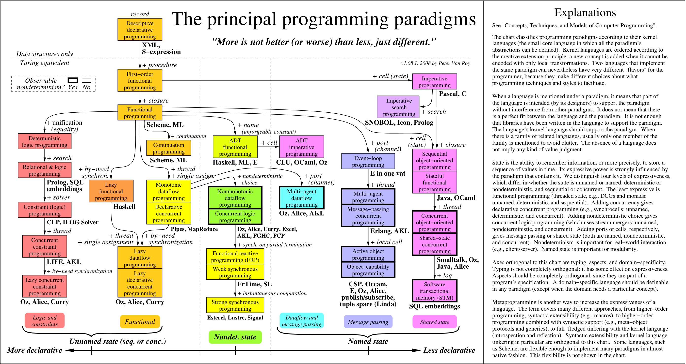

# Clean Code Basic Notes

<!-- TOC -->

- [Clean Code Basic Notes](#clean-code-basic-notes)
  - [Programming Principles](#programming-principles)
    - [SOLID principle](#solid-principle)
      - [Single Responsibility Principle](#single-responsibility-principle)
      - [Open-Closed Principle](#open-closed-principle)
      - [Liskov Substitution Principle](#liskov-substitution-principle)
      - [Interface Segregation Principle](#interface-segregation-principle)
      - [Dependency Inversion Principle](#dependency-inversion-principle)
  - [Programming Paradigms](#programming-paradigms)
    - [Taxonomy of Paradigms](#taxonomy-of-paradigms)
      - [Observable Nondeterminism](#observable-nondeterminism)
      - [Named State](#named-state)
    - [Functional Programming](#functional-programming)

<!-- /TOC -->

## Programming Principles

### SOLID principle

#### Single Responsibility Principle

A class should have only one job

```js
class Animal {
  constructor(name) {}
  getAnimalName() {}
  saveAnimal(animal) {}
}

// =>

class Animal {
  constructor(name) {}
  getAnimalName() {}
}
class AnimalDB {
  getAnimal(animal) {}
  saveAnimal(animal) {}
}
```

#### Open-Closed Principle

Software entities(Classes, modules, functions) should be open for extension,
close for modification.

```java
const animals: Array<Animal> = [
    new Animal('lion'),
    new Animal('mouse')
];

function AnimalSound(a: Array<Animal>) {
    for(int i = 0; i <= a.length; i++) {
        if(a[i].name == 'lion')
            log('roar');
        if(a[i].name == 'mouse')
            log('squeak');
    }
}
AnimalSound(animals);
```

```java
class Animal {
        makeSound();
        //...
}
class Lion extends Animal {
    makeSound() {
        return 'roar';
    }
}
class Squirrel extends Animal {
    makeSound() {
        return 'squeak';
    }
}
class Snake extends Animal {
    makeSound() {
        return 'hiss';
    }
}
//...
function AnimalSound(a: Array<Animal>) {
    for(int i = 0; i <= a.length; i++) {
        log(a[i].makeSound());
    }
}
AnimalSound(animals);
```

```java
class Discount {
    giveDiscount() {
        if(this.customer == 'fav') {
            return this.price * 0.2;
        }
        if(this.customer == 'vip') {
            return this.price * 0.4;
        }
    }
}
```

```java
class VIPDiscount: Discount {
    getDiscount() {
        return super.getDiscount() * 2;
    }
}

class SuperVIPDiscount: VIPDiscount {
    getDiscount() {
        return super.getDiscount() * 2;
    }
}
```

#### Liskov Substitution Principle

A sub-class must be substitutable for its super-class

```java
function AnimalLegCount(a: Array<Animal>) {
    for(int i = 0; i <= a.length; i++) {
        if(typeof a[i] == Lion)
            log(LionLegCount(a[i]));
        if(typeof a[i] == Mouse)
            log(MouseLegCount(a[i]));
        if(typeof a[i] == Snake)
            log(SnakeLegCount(a[i]));
    }
}
AnimalLegCount(animals);
```

```java
class Animal {
    //...
    LegCount();
}

//...
class Lion extends Animal{
    //...
    LegCount() {
        //...
    }
}
//...

function AnimalLegCount(a: Array<Animal>) {
    for(let i = 0; i <= a.length; i++) {
        a[i].LegCount();
    }
}
AnimalLegCount(animals);
```

#### Interface Segregation Principle

- Make **fine grained** interfaces that are client specific
- Clients should not be forced to depend upon interfaces that they do not use

```java
interface IShape {
    drawCircle();
    drawSquare();
    drawRectangle();
}

class Circle implements IShape {
    drawCircle(){
        //...
    }
    drawSquare(){
        //...
    }
    drawRectangle(){
        //...
    }
}
class Square implements IShape {
    drawCircle(){
        //...
    }
    drawSquare(){
        //...
    }
    drawRectangle(){
        //...
    }
}
class Rectangle implements IShape {
    drawCircle(){
        //...
    }
    drawSquare(){
        //...
    }
    drawRectangle(){
        //...
    }
}
```

```java
interface IShape {
    draw();
}
interface ICircle {
    drawCircle();
}
interface ISquare {
    drawSquare();
}
interface IRectangle {
    drawRectangle();
}
interface ITriangle {
    drawTriangle();
}
class Circle implements ICircle {
    drawCircle() {
        //...
    }
}
class Square implements ISquare {
    drawSquare() {
        //...
    }
}
class Rectangle implements IRectangle {
    drawRectangle() {
        //...
    }
}
class Triangle implements ITriangle {
    drawTriangle() {
        //...
    }
}
class CustomShape implements IShape {
   draw(){
      //...
   }
}
```

OR

```java
class Circle implements IShape {
    draw(){
        //...
    }
}

class Triangle implements IShape {
    draw(){
        //...
    }
}

class Square implements IShape {
    draw(){
        //...
    }
}

class Rectangle implements IShape {
    draw(){
        //...
    }
}
```

#### Dependency Inversion Principle

Dependency should be on **abstractions** not concretions:

- High-level modules should not depend upon low-level modules.
  Both should depend upon **abstractions**
- Abstractions should not depend on details. Details should depend upon abstractions

```java
class XMLHttpService extends XMLHttpRequestService {}
class Http {
    constructor(private xmlhttpService: XMLHttpService) { }
    get(url: string , options: any) {
        this.xmlhttpService.request(url,'GET');
    }
    post() {
        this.xmlhttpService.request(url,'POST');
    }
    //...
}
```

```java
interface Connection {
    request(url: string, opts:any);
}

// Abstraction not upon on details (but upon on abstractions)
class Http {
    constructor(private httpConnection: Connection) { }
    get(url: string , options: any) {
        this.httpConnection.request(url,'GET');
    }
    post() {
        this.httpConnection.request(url,'POST');
    }
    //...
}

class XMLHttpService implements Connection {
    const xhr = new XMLHttpRequest();
    //...
    request(url: string, opts:any) {
        xhr.open();
        xhr.send();
    }
}
class NodeHttpService implements Connection {
    request(url: string, opts:any) {
        //...
    }
}
class MockHttpService implements Connection {
    request(url: string, opts:any) {
        //...
    }
}
```

## Programming Paradigms

Each programming language realizes one or more paradigms.
Each paradigm is defined by a set of programming concepts.

### Taxonomy of Paradigms



Nondeterminism is important for real-world interaction.
Named state is important for modularity.

#### Observable Nondeterminism

During the execution, this choice is made by
a part of the run-time system called the scheduler.
The nondeterminism is observable
if a user can see **different results** from executions
that start at the **same internal configuration**.

- concurrency or race condition (timing effects)
- shared-state concurrency or message-passing concurrency
- concurrent programming language e.g Java

#### Named State

State is the ability to remember information (a sequence of values in time).
Distinguish three axes of expressiveness, depending on whether the state is:

- unnamed or named
- deterministic or nondeterministic
- sequential or concurrent
- named, nondeterministic and concurrent paradigmh
  as the most expressiveness of state
- named state for updatable memory (mutable state) and modularity

The least expressive combination is functional programming
(threaded state: unnamed, deterministic, sequential).
Adding concurrency gives declarative concurrent programming
(synchrocells: unnamed, deterministic, concurrent).
Adding nondeterministic choice gives concurrent logic programming
(stream mergers: unnamed, nondeterministic, concurrent).
Adding ports or cells, gives message passing or shared state
(named, nondeterministic, concurrent).

### Functional Programming

Based on the concept of first-class function or closure,
which makes it equivalent to the λ-calculus which is `Turing complete`.
